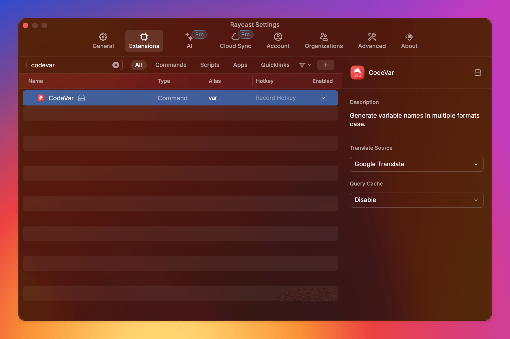

<h1>
  CodeVar
  
</h1>

Generate variable names in multiple formats case.

### Usage

```bash
git clone https://github.com/ifyour/code-var.git

cd code-var

npm i && npm run dev
```

### Screenshot

Call up Raycast and search for CodeVar. Input the variable you want to translate, and press `Enter` to copy it to the clipboard. Alternatively, you can press `Cmd` + `Enter` to copy and paste it. Enjoy using CodeVar!


You can navigate to CodeVar in the Extensions tab to set its translation source and whether you need to enable query caching.



### License

MIT
