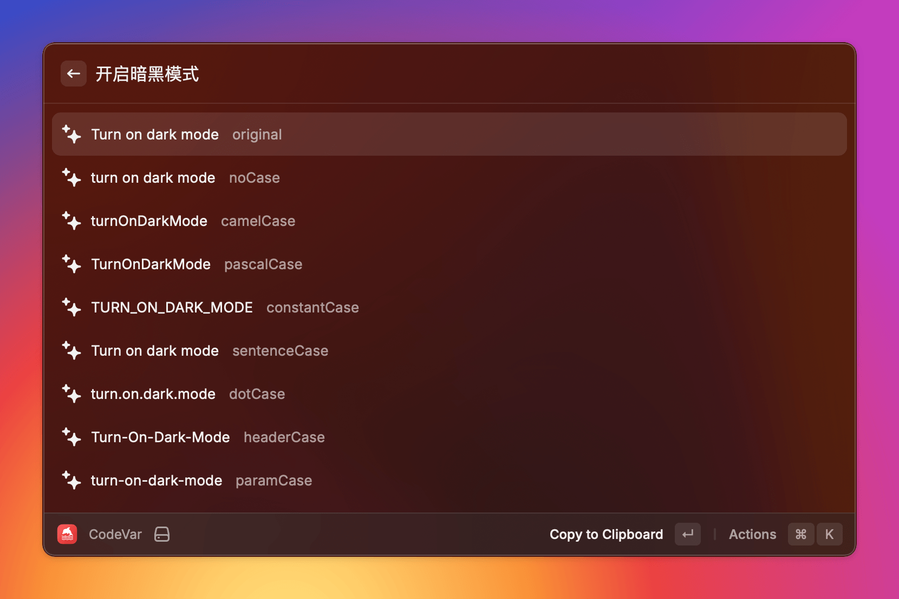

<h1>
  CodeVar
  
</h1>

CodeVar is a variable naming tool for [Raycast](https://www.raycast.com/) extensions powered by Tencent TranSmart.

### Usage

To use CodeVar, follow these steps:

```bash
git clone https://github.com/ifyour/code-var.git

cd code-var

yarn && yarn dev
```

### Screenshot

Call up Raycast and search for CodeVar. Input the variable you want to translate, and press `Enter` to copy it to the clipboard. Alternatively, you can press `Cmd` + `Enter` to copy and paste it. Enjoy using CodeVar!



### License

CodeVar is licensed under the MIT License.
